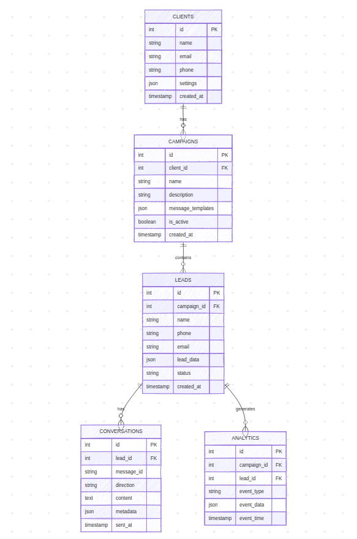

# AI Sales Agent System

## Overview

An intelligent AI-powered sales agent system designed for digital marketing agencies to automatically engage with sales leads from social media advertising campaigns.

## Business Context

- **Client**: Digital marketing agency in Singapore
- **Problem**: Manual follow-up with sales leads from Facebook/Instagram/TikTok ads is time-consuming
- **Solution**: AI agent that automatically sends personalized WhatsApp messages to leads
- **Integration**: Works with existing Privyr CRM system

## System Architecture

### DB diagram

### Core Components

1. **Lead Management System** - Processes leads from Privyr CRM
2. **AI Agent Engine** - Generates personalized messages
3. **WhatsApp Integration** - Sends messages via Twilio
4. **Analytics Dashboard** - Tracks performance and conversions
5. **Campaign Management** - Manages different client campaigns

### Technology Stack

- **Backend**: Python with FastAPI
- **AI/LLM**: OpenAI GPT-4 for message generation
- **Database**: PostgreSQL for lead and conversation data
- **Messaging**: Twilio WhatsApp Business API
- **CRM Integration**: Privyr API
- **Deployment**: Ubuntu server with Docker
- **Frontend**: React dashboard for campaign management

## Features

### For Marketing Agency

- Multi-client campaign management
- Customizable message templates
- Performance analytics and reporting
- Lead scoring and prioritization
- A/B testing for message optimization

### For Clients

- Automated personalized follow-up
- 24/7 lead engagement
- Conversation history tracking
- Conversion tracking
- Integration with existing CRM

## Requirements from Client

- Twilio business phone number
- Privyr API access
- Client information and messaging guidelines
- Sample lead data for testing
